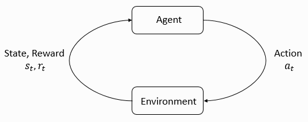
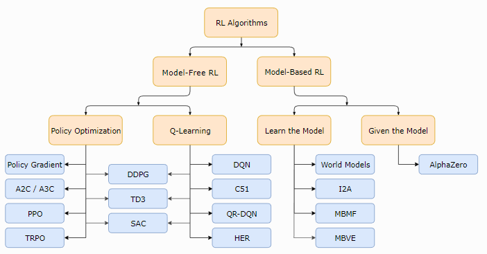

Reinforcement-Learning-PyTorch

Email: autuanliu@163.com

[TOC]

## 目录

### 算法

- [Vanilla Policy Gradient](https://spinningup.openai.com/en/latest/algorithms/vpg.html) (VPG)
- [Trust Region Policy Optimization](https://spinningup.openai.com/en/latest/algorithms/trpo.html) (TRPO)
- [Proximal Policy Optimization](https://spinningup.openai.com/en/latest/algorithms/ppo.html) (PPO)
- [Deep Deterministic Policy Gradient](https://spinningup.openai.com/en/latest/algorithms/ddpg.html) (DDPG)
- [Twin Delayed DDPG](https://spinningup.openai.com/en/latest/algorithms/td3.html) (TD3)
- [Soft Actor-Critic](https://spinningup.openai.com/en/latest/algorithms/sac.html) (SAC)

## 内容

### 基本知识

**强化学习**（英语：Reinforcement learning，简称RL）是[机器学习](https://zh.wikipedia.org/wiki/%E6%9C%BA%E5%99%A8%E5%AD%A6%E4%B9%A0)中的一个领域，强调如何基于[环境](https://zh.wikipedia.org/wiki/%E7%8E%AF%E5%A2%83)而行动，以取得最大化的预期利益。其灵感来源于心理学中的[行为主义](https://zh.wikipedia.org/wiki/%E8%A1%8C%E4%B8%BA%E4%B8%BB%E4%B9%89)理论，即有机体如何在环境给予的奖励或惩罚的刺激下，逐步形成对刺激的预期，产生能获得最大利益的习惯性行为。这个方法具有普适性，因此在其他许多领域都有研究。

强化学习和标准的[监督式学习](https://zh.wikipedia.org/wiki/%E7%9B%A3%E7%9D%A3%E5%BC%8F%E5%AD%B8%E7%BF%92)之间的区别在于，它并不需要出现正确的输入/输出对，也不需要精确校正次优化的行为。强化学习更加专注于在线规划，需要在探索（在未知的领域）和遵从（现有知识）之间找到平衡。

Agent 和 Environment 是强化学习中最重要的概念。Agent 在 Environment 中生存并与其交互，在交互的过程中，Agent 观察到 Environment 的状态（或部分状态）并作出相应的动作，Environment 的状态可能在交互的过程中发生改变，也有可能自身发生状态的改变。

Agent 会从 Environment 接收到一个奖励信号（用于衡量当前状态的好坏程度）。Agent 的目标是最大化累积奖励（回报）。强化学习是 Agent 通过不断采取最佳的行动策略，以实现某个目标的方法。

Agent 根据 observation 作出 action，而且 Agent 没有访问 state 的权利。

### 术语表

|    术语    |            terminology             | 含义                                                         |
| :--------: | :--------------------------------: | ------------------------------------------------------------ |
|    状态    |               state                | environment 状态的完备描述，包含环境的一切信息               |
|   观测值   |            observation             | environment 状态的部分描述，可能忽略某些信息                 |
| 完全可观测 |           fully observed           | 当 agent 能够观测到 environment 的完整状态                   |
| 部分可观测 |         partially observed         | 当 agent 只能够观测到 environment 的部分状态                 |
|  动作空间  |            action space            | 不同的 environment 会有不同的 actions，environment 的所有 actions 构成动作空间（连续取值或者离散取值） |
|    策略    |               policy               | 策略是 agent 用于决定下一步采取什么行动的规则（确定的或随机的） |
|    轨迹    |    trajectory, episode, rollout    | 轨迹指的是状态和动作的序列 $\tau = (s_0, a_0, s_1, a_1, ...)$ |
|    奖励    |              reward,               | 奖励由当前状态、已经执行的动作和下一步的状态共同决定 $r_{t}=R\left(s_{t}, a_{t}, s_{t+1}\right)$ |
| 回报, 收益 |               return               | 累积奖励                                                     |
| 无衰减回报 | finite-horizon undiscounted return | 在一个固定窗口步数内获得的累计奖励 $R(\tau)=\sum_{t=0}^{T} r_{t}$ |
|  衰减回报  | infinite-horizon discounted return | Agent 获得的全部奖励之和，但是奖励会因为获得的时间不同而衰减 $R(\tau)=\sum_{t=0}^{\infty} \gamma^{t} r_{t}$ |

### 强化学习的问题

无论选择哪种方式衡量收益（无衰减收益或衰减收益），无论选择哪种策略，强化学习的目标都是选择一种策略从而最大化 预期收益。

假设环境转换和策略都是随机的。这种情况下， $T$ 步 行动轨迹是：
$$
P(\tau | \pi)=\rho_{0}\left(s_{0}\right) \prod_{t=0}^{T-1} P\left(s_{t+1} | s_{t}, a_{t}\right) \pi\left(a_{t} | s_{t}\right)
$$
预期收益是$J(\pi)$
$$
J(\pi)=\int_{\tau} P(\tau | \pi) R(\tau)=\underset{\tau \sim \pi}{E}[R(\tau)]
$$
强化学习中的核心优化问题可以表示为：
$$
\pi^{*}=\arg \max _{\pi} J(\pi)
$$
$\pi^{*}​$ 是最优策略。

### 值函数

状态的**值**或者**状态行动对**(state-action pair)都是非常用于的信息。这里的**值**指的是，如果你从某一个状态或者状态行动对开始，一直按照某个策略进行下去最终获得的期望回报。几乎所有的强化学习方法，都在使用值函数。

1. **On-Policy Value Function** **：** $V^{\pi}(s)$，从某一个状态 $s$ 开始，之后每一步行动都按照策略 $\pi$ 执行

$$
V^{\pi}(s)=\underset{\tau \sim \pi}{\mathrm{E}}\left[R(\tau) | s_{0}=s\right]
$$

2. **On-Policy Action-Value Function**: 从某一个状态开始，先随便执行一个行动（有可能不是按照策略走的），之后每一步都按照固定的策略执行

$$
Q^{\pi}(s, a)=\underset{\tau \sim \pi}{\mathrm{E}}\left[R(\tau) | s_{0}=s, a_{0}=a\right]
$$

3.  **Optimal Value Function**: 从某一个状态开始，之后每一步都按照 **最优策略**执行

$$
V^{*}(s)=\max _{\pi} \underset{\tau \sim \pi}{\mathrm{E}}\left[R(\tau) | s_{0}=s\right]
$$

4. **Optimal Action-Value Function**: 从某一个状态开始，先随便执行一个行动（有可能不是按照策略走的），之后每一步都按照 **最优策略** 执行
   $$
   Q^{*}(s, a)=\max _{\pi} \underset{\tau \sim \pi}{\mathrm{E}}\left[R(\tau) | s_{0}=s, a_{0}=a\right]
   $$

### 贝尔曼方程

全部四个值函数都遵守 **贝尔曼方程**，贝尔曼方程的基本思想是：起始点的值等于当前点预期值和下一个点的值之和。

同策略值函数的贝尔曼方程
$$
\begin{aligned} V^{\pi}(s) &=\underset{g^{\prime} \sim P}{\mathrm{E}}\left[r(s, a)+\gamma V^{\pi}\left(s^{\prime}\right)\right] \\ Q^{\pi}(s, a) &=\underset{s^{\prime} \sim P}{\mathrm{E}}\left[r(s, a)+\gamma \underset{a^{\prime} \sim \pi}{\mathrm{E}}\left[Q^{\pi}\left(s^{\prime}, a^{\prime}\right)\right]\right] \end{aligned}
$$
最优值函数的贝尔曼方程
$$
\begin{aligned} V^{*}(s) &=\max _{a} \underset{s^{\prime} \sim P}{\mathrm{E}}\left[r(s, a)+\gamma V^{*}\left(s^{\prime}\right)\right] \\ Q^{*}(s, a) &=\underset{s^{\mathrm{E}}}{\mathrm{E}}\left[r(s, a)+\gamma \max _{a^{\prime}} Q^{*}\left(s^{\prime}, a^{\prime}\right)\right] \end{aligned}
$$
同策略值函数和最优值函数的贝尔曼方程最大的区别是是否在行动中取 $\max$。这表明 agent 在选择下一步行动时，为了做出最优行动，他必须选择能获得最大值的行动。

### 优势函数

强化学习中，有些时候我们不需要描述一个行动的绝对好坏，而只需要知道它相对于平均水平的优势。

一个服从策略 $\pi $  的优势函数，描述的是它在状态$s$下采取行为$a$ 比随机选择一个行为好多少（假设之后一直服从策略 $\pi$ ）
$$
A^{\pi}(s, a)=Q^{\pi}(s, a)-V^{\pi}(s)
$$

## 强化学习分类

## 参考资料

1. [Welcome to Spinning Up in Deep RL! — Spinning Up documentation](https://spinningup.openai.com/en/latest/index.html)
2. [openai/spinningup: An educational resource to help anyone learn deep reinforcement learning.](https://github.com/openai/spinningup)
3. [强化学习 - 维基百科，自由的百科全书](https://zh.wikipedia.org/wiki/%E5%BC%BA%E5%8C%96%E5%AD%A6%E4%B9%A0)

**Notes: 难免有错，欢迎指正**